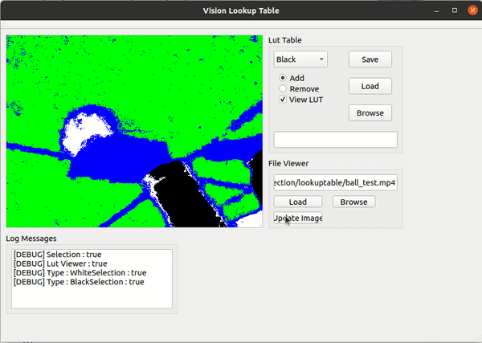

# Image Segmentation - Look Up Tables (LUTs)


## About

This is an old project back in my humanoid robotics team. The task was to create an image segmentation using Look Up Table (LUT) to segment multiple objects. By selecting an interest area in the image, convert all values in that Region of Interest (ROI) from BGR to HSV (or any other color space) and assign a class or category for all values in the table.

The categories:
- Other = 0 (Labeled as *Blue*)
- Soccer Field = 1 (Labeled as *Green*)
- Balls and Field Lines = 2 (Labeled as *White*)
- Obstacles = 3 (Labeled as *Black*)

The table is a single long array consists of $\text{BINS}^3$ where *BINS* is 64 ($2^6$) to reduce LUT size and memory. The single array will map the HSV value into positional index in the LUT using:


I forgot the LUTs original repository, but credit goes to the original author.

## Requirements

- OpenCV 4
- Qt5
- yaml-cpp

Build the executable using CMake:
```
cmake .
make -j4
```

## How To Use




Run the GUI
```
./vision_lookuptable
```

1. Browse the video path
2. Load the video
3. Change the class `{Green, White, Black, Other}` or selection mode `{Add, Remove}`
4. Update each frames
5. Select the Region of Interest (ROI) in the image viewer using the cursor. Select the first point and drag to the second point (drawn in rectangle).
6. View the result by enabling `View LUT`
7. Save the final result

## Qt Graphical User Interface


### File Viewer

- `Browse` button : Search the video file.
- `Load` button : Load the video from given path.
- `Update Image` button : Update the next frame from video file.

### Lut Table
- `Save` button : Save the current LUT to `lut.xml`.
- `Browse` button : Search the `lut.xml` file.
- `Load` button : Load the LUT from given path.

- Dropdown Menu : Segmentation Class `{Green, White, Black, Other}`.
- `Add` radio button : Add all values in the Rectangular ROI to the selected class in LUTs .
- `Remove` radio button : Remove all values in the Rectangular ROI to the selected class in LUTs.
- `View LUT` checkbox: Display the segmentation result in HSV color space.

## Files
- `main_window.cpp` : Central class of main application functions and gui interactions. 
- `image_clip.cpp` : The main LUTs functions.
- `gui.ui` : User Interface file written in Qt UI XML